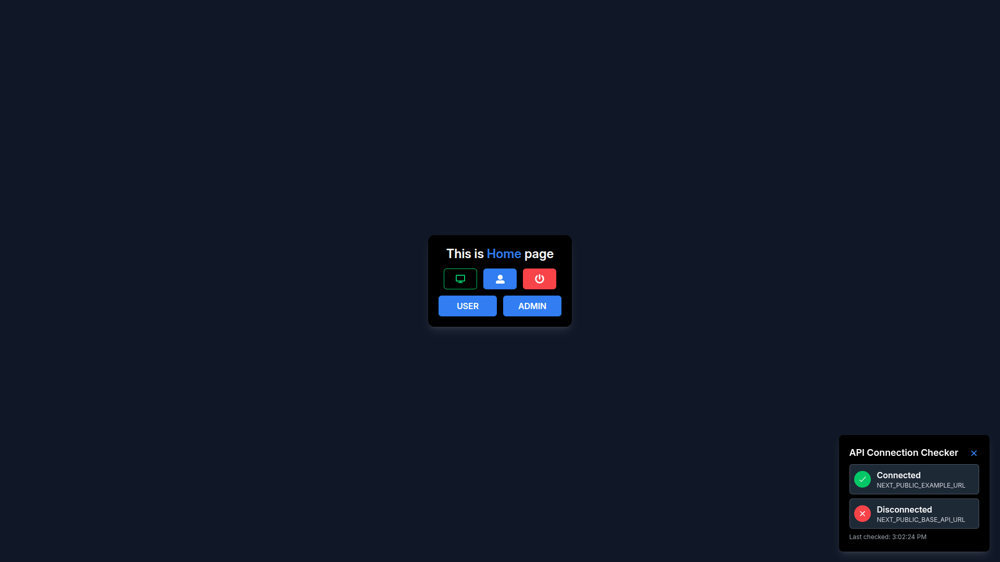
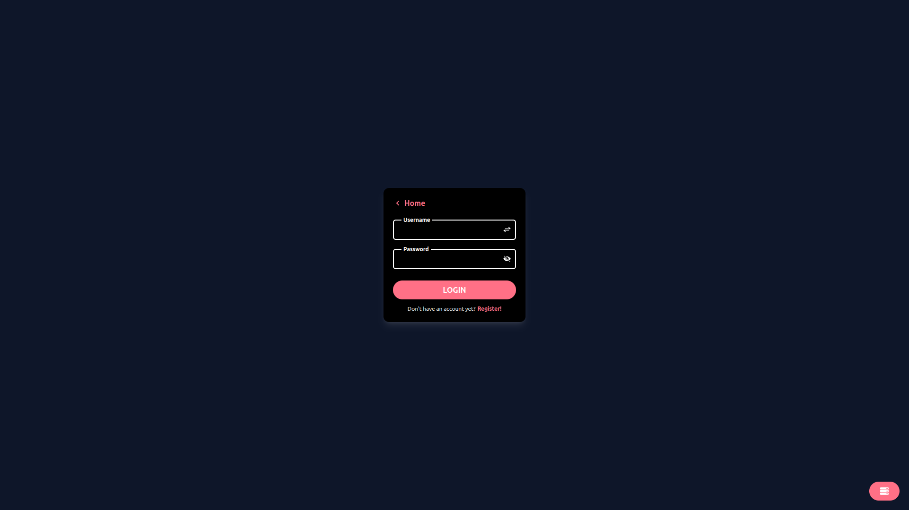
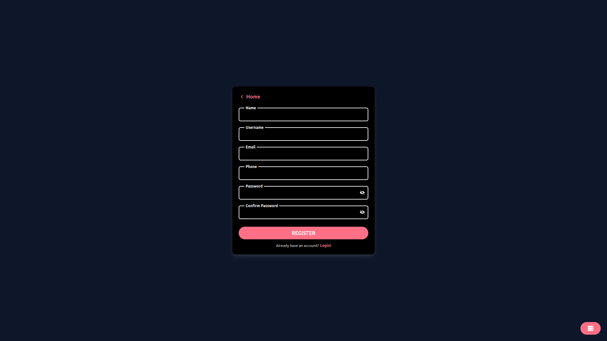
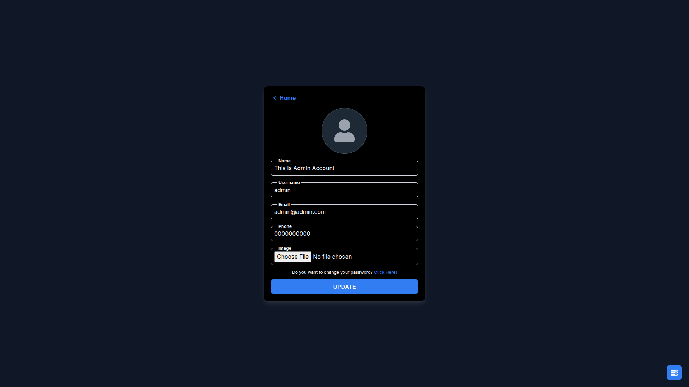
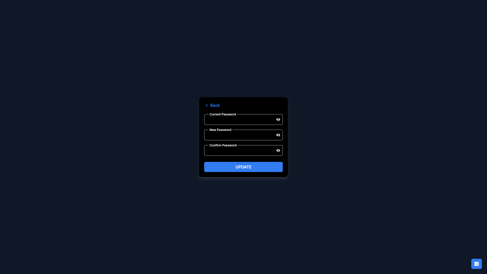
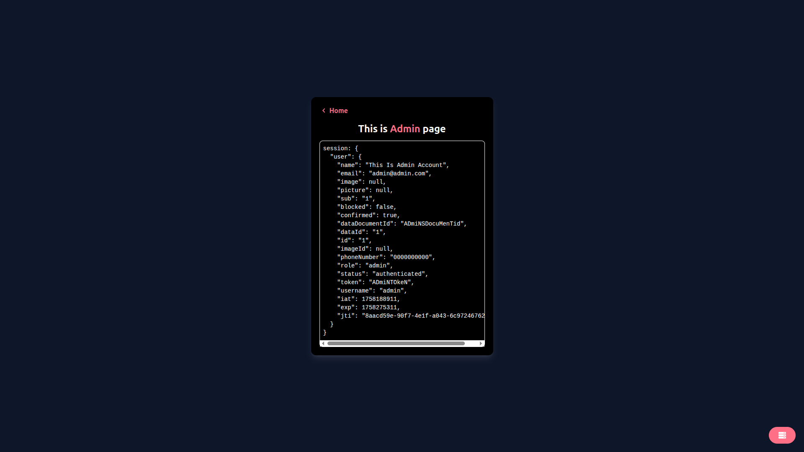

# Next.js Boilerplate

Boilerplate By [Gede Dewo Wahyu M.W](https://github.com/gdwmw) ❤️

## Boilerplate Description 📖

This boilerplate is a web application built with Next.js, a React framework for modern web development. It includes features such as authentication, theme management, state management, form validation, and more. It also follows Atomic Design principles for organizing components.

## Boilerplate Structure 📂

Below is the primary directory structure of the boilerplate:

```
└── 📁Next.js-Boilerplate
    └── 📁configs
        ├── authentication.ts
    └── 📁docs
        ├── example.codediagram
        ├── example.drawio
        ├── example.postman_collection.json
    └── 📁public
        └── 📁assets
            └── 📁animations
                └── 📁loadings
                    ├── Loading-B.svg
                    ├── Loading-W.svg
            └── 📁images
                └── 📁logos
                    ├── Next.svg
                    ├── Vercel.png
                    ├── Vercel.svg
                └── 📁project
                    ├── 1.png
                    ├── 2.png
                    ├── 3.png
                    ├── 4.png
                    ├── 5.png
                    ├── 6.png
    └── 📁src
        └── 📁app
            └── 📁_example
                └── 📁modules
                    └── 📁aside
                        └── 📁batches
                            ├── .gitkeep
                        ├── index.tsx
                    └── 📁footer
                        └── 📁batches
                            ├── .gitkeep
                        ├── index.tsx
                    └── 📁header
                        └── 📁batches
                            ├── .gitkeep
                        ├── index.tsx
                    └── 📁main
                        └── 📁batches
                            ├── .gitkeep
                        ├── index.tsx
                    └── 📁nav
                        └── 📁batches
                            ├── .gitkeep
                        ├── index.tsx
                    ├── index.ts
                ├── index.tsx
            └── 📁_layout
                └── 📁modules
                    └── 📁aside
                        └── 📁batches
                            ├── .gitkeep
                        ├── index.tsx
                    └── 📁footer
                        └── 📁batches
                            ├── .gitkeep
                        ├── index.tsx
                    └── 📁header
                        └── 📁batches
                            ├── .gitkeep
                        ├── index.tsx
                    └── 📁main
                        └── 📁batches
                            ├── .gitkeep
                        ├── index-example.tsx
                        ├── index.tsx
                    └── 📁nav
                        └── 📁batches
                            ├── .gitkeep
                        ├── index.tsx
                    ├── index.ts
                ├── index.tsx
            └── 📁(authed)
                └── 📁(admin)
                    ├── .gitkeep
                └── 📁(user)
                    └── 📁password
                        └── 📁change
                            └── 📁_layout
                                └── 📁modules
                                    └── 📁main
                                        ├── index.tsx
                                        ├── schema.ts
                                    ├── index.ts
                                ├── index.tsx
                            ├── page.tsx
                    └── 📁profile
                        └── 📁_layout
                            └── 📁modules
                                └── 📁main
                                    ├── index.tsx
                                    ├── schema.ts
                                ├── index.ts
                            ├── index.tsx
                        ├── page.tsx
            └── 📁(example)
                └── 📁admin-example
                    ├── page.tsx
                └── 📁home-example
                    ├── page.tsx
                └── 📁user-example
                    ├── page.tsx
            └── 📁api
                └── 📁auth
                    └── 📁[...nextauth]
                        ├── route.ts
            └── 📁authentication
                └── 📁login
                    └── 📁_layout
                        └── 📁modules
                            └── 📁main
                                ├── index.tsx
                                ├── schema.ts
                            ├── index.ts
                        ├── index.tsx
                    ├── page.tsx
                └── 📁register
                    └── 📁_layout
                        └── 📁modules
                            └── 📁main
                                ├── index.tsx
                                ├── schema.ts
                            ├── index.ts
                        ├── index.tsx
                    ├── page.tsx
            └── 📁denied
                ├── page.tsx
            └── 📁fonts
                ├── GeistMonoVF.woff
                ├── GeistVF.woff
                ├── index.ts
                ├── Inter.ttf
                ├── Roboto.ttf
            ├── favicon.ico
            ├── globals.css
            ├── layout.tsx
            ├── not-found.tsx
            ├── page.tsx
        └── 📁components
            └── 📁elements
                └── 📁example
                    └── 📁A
                        ├── ExampleA.spec.tsx
                        ├── ExampleA.stories.tsx
                        ├── ExampleA.tsx
                        ├── index.ts
                    └── 📁B
                        └── 📁stories
                            ├── ExampleB.stories.tsx
                            ├── StoriesLayout.tsx
                        ├── ExampleB.spec.tsx
                        ├── ExampleB.tsx
                        ├── index.ts
                    └── 📁C
                        └── 📁elements
                            ├── ExampleErrorMessage.tsx
                            ├── ExampleInputsContainer.tsx
                            ├── ExampleLabel.tsx
                            ├── index.ts
                        └── 📁stories
                            ├── ExampleC.stories.tsx
                            ├── StoriesLayout.tsx
                        ├── ExampleC.spec.tsx
                        ├── ExampleDatePicker.tsx
                        ├── ExampleInput.tsx
                        ├── ExampleSelect.tsx
                        ├── ExampleTextArea.tsx
                        ├── index.ts
                        ├── type.ts
                    ├── index.ts
                ├── index.ts
            └── 📁templates
                ├── APIConnectionChecker.tsx
                ├── Avatar.tsx
                ├── ChangeThemeButton.tsx
                ├── FormContainer.tsx
                ├── index.ts
                ├── LogoutButton.tsx
                ├── SubmitButton.tsx
            ├── index.ts
            ├── README.md
        └── 📁constants
            ├── authentication.ts
            ├── index.ts
            ├── schemasErrorMessage.ts
        └── 📁context
            ├── index.ts
            ├── type.ts
            ├── useGlobalContext.ts
        └── 📁hooks
            ├── index.ts
            ├── useLocalStorage.ts
            ├── useModal.ts
            ├── useToast.ts
            ├── useToggle.ts
            ├── useWindowSize.ts
        └── 📁libs
            └── 📁providers
                ├── index.ts
                ├── NextAuthProvider.tsx
                ├── NextThemesProvider.tsx
                ├── ReactQueryProvider.tsx
            ├── index.ts
            ├── twm.ts
        └── 📁styles
            ├── datepicker.css
        └── 📁types
            ├── authentication.ts
            ├── index.ts
            ├── next-auth.d.ts
        └── 📁utils
            └── 📁api
                └── 📁authentication
                    ├── index.ts
                    ├── login.ts
                    ├── register.ts
                ├── base.ts
                ├── data.ts
                ├── example.ts
                ├── index.ts
                ├── password.ts
                ├── upload.ts
                ├── user.ts
            └── 📁server
                ├── cookies.ts
                ├── getBase64.ts
                ├── index.ts
                ├── session.ts
            ├── formatter.ts
            ├── index.ts
            ├── math.ts
            ├── validations.ts
        ├── proxy.ts
```

### Structure Explanation 📚

- **/configs**: Configuration files, including authentication settings and shared logic.
- **/docs**: Project documentation such as architecture diagrams, flowcharts, API docs, and other technical references.
- **/public**: Static assets such as images and animations.
- **/src/app**: Application routes and pages using the Next.js App Router. Each route uses a collocated `_layout/` folder (prefixed with `_` so it's excluded from routing) containing the page's layout composition and modules. Route groups `(authed)` and `(example)` organize authenticated and demo pages respectively. Top-level `_layout/` and `_example/` serve as shared layout compositions for the home and example pages.
- **/src/components**: Reusable UI pieces organized with Atomic Design principles — `elements/` for atomic/small components and `templates/` for composed, higher-level components.
- **/src/constants**: Application-wide constants and configuration data, including authentication defaults and schema error messages.
- **/src/context**: Global state management using Zustand, with collocated type definitions.
- **/src/hooks**: Custom React hooks for managing UI state and side effects (modal, toast, toggle, local-storage, window-size).
- **/src/libs**: Third-party library wrappers — providers (NextAuth, NextThemes, React Query) and Tailwind merge utility.
- **/src/styles**: Global styles and component-level stylesheets.
- **/src/types**: Shared TypeScript type definitions, including NextAuth type augmentation.
- **/src/utils**: Utility functions covering API wrappers, formatting, math operations, server-side helpers (cookies, session, getbase64), and input validations.
- **/src/proxy.ts**: NextAuth-aware middleware that guards protected routes with role-based access control.

## Installation 🚀

To get started, follow these steps:

1. **Clone the repository**

   ```bash
   git clone https://github.com/gdwmw/Next.js-Boilerplate.git
   cd Next.js-Boilerplate
   ```

2. **Install dependencies**

   ```bash
   pnpm install
   ```

3. **Set up environment variables**

   ```bash
   pnpm cpenv
   ```

4. **Set `NEXTAUTH_URL` to your local URL**

   ```bash
   http://localhost:3000
   ```

5. **Generate a base64 value for `NEXTAUTH_SECRET`**

   ```bash
   pnpm base64
   ```

6. **Run the development server**

   ```bash
   pnpm dev
   ```

7. **Access the application**

   Open your browser and navigate to [http://localhost:3000](http://localhost:3000).

## Commit Guidelines 📝

When committing changes with `pnpm commit`, follow these steps:

1. **Prepare your changes**  
   Ensure your code is tested and complies with the project's coding standards.

2. **Stage your changes**  
   Stage all relevant files:

   ```bash
   git add .
   ```

3. **Run the commit command**  
   Execute:

   ```bash
   pnpm commit
   ```

4. **Follow the interactive prompt**  
   Select the appropriate change type (e.g., feature, fix, docs) when prompted.

5. **Optionally provide a scope**  
   If relevant, specify the scope (e.g., a specific module or feature).

6. **Write a concise subject**  
   Use the imperative mood and keep it short and clear.

7. **Optionally add a detailed body**  
   Include motivation, context, and implementation details if helpful.

8. **Document breaking changes (if any)**  
   Clearly list any breaking changes in the designated section.

9. **Confirm your commit**  
   Review the message and confirm when prompted.

Following these guidelines ensures commit messages are informative and consistent with the project's standards.

## Contribution 🤝

If you would like to contribute, follow these steps:

1. **Fork the repository**  
   Click the "Fork" button at the top right of the repository page.

2. **Clone your fork**  
   Clone your forked repository to your local machine:

   ```bash
   git clone https://github.com/your-username/Next.js-Boilerplate.git
   cd Next.js-Boilerplate
   ```

3. **Create a new branch**  
   Create a branch for your feature or bug fix:

   ```bash
   git checkout -b your-feature-branch
   ```

4. **Make your changes**  
   Implement your changes and ensure they follow the project's standards.

5. **Commit your changes**  
   Commit with a descriptive message:

   ```bash
   pnpm commit
   ```

6. **Push to your fork**  
   Push your branch to your forked repository:

   ```bash
   git push origin your-feature-branch
   ```

7. **Open a pull request**  
   In the original repository, click "New Pull Request", select your branch, and submit with a clear description.

Thank you for contributing!

## MIT License ⚖️

This project is licensed under the MIT License. See the `LICENSE` file for details.

## How to Ask Questions ❓

If you have questions about the boilerplate or how to use it, follow these guidelines:

1. **Be clear and concise**  
   Clearly state your question or issue and provide enough context.

2. **Include relevant details**  
   Share specific errors, code snippets, or configurations that are relevant.

3. **Search before asking**  
   Review the documentation and existing issues to avoid duplicates.

4. **Use proper formatting**  
   Use code blocks when sharing code or error messages for readability.

5. **Be respectful**  
   Be polite and respectful in all communication.

Following these guidelines helps ensure your questions are understood and answered promptly.

This documentation provides an overview of the boilerplate, installation steps, commit guidelines, and contribution process. If you have further questions, feel free to ask!
